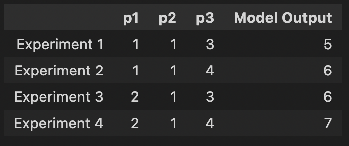

# Experiment Manager

The Experiment Manager is a Python decorator to help automate and manage running experiments, especially for data science and in notebook development environments.

## Setup

1. Download `expt_mgr.py` from this [GitHub Gist](https://gist.github.com/vsiv16/b42431beff8c76a79046ee7162d6f6e6)

2. Move `expt_mgr.py` into your project's directory (wherever the experiment code you would like to automate is!) 

## Usage

1. Import the `experiment_entry` decorator as follows:
    ```
    from expt_mgr import experiment_entry
    ```

2. Annotate the function you would like to automate as an experiment with `@experiment-entry` in order to apply the decorator to it. 

3. Create lists of any parameter combinations you wish to try out across experiment trials, and supply them to the decorator as keyword arguments. Experiment Manager will automatically run all parameter combinations for you!

    *Note:* Make sure to keep the naming of the keyword arguments consistent with the original parameter names in the function!

4. Finally, simply call the function *(without any parameters)*.

### Example Usage:

```
    # parameters
    p1_list = [1, 2, 3]
    p2_list = [1]
    p3_list = [3, 4]

    # model1() function annotated with @experiment_entry decorator
    @experiment_entry(p1=p1_list, p2=p2_list, p3=p3_list)
    def model1(p1, p2, p3):
        return p1 + p2 + p3

    model1()
```

## What to Expect

### Outputs

Upon running the experiment code/cell, you should see an output summary table containing the experiment trial number, the parameter values utilized, and the function/model output.

#### Example Output Summary Table:


### Logging

- All experiment logs are saved by Experiment Manager in a dedicated folder within your project called `.log_records`
- For every run of a decorated experiment function, Experiment Manager saves a timestamped folder (named like `run_<date>_<time>`) within `log_records` containing:

1. A copy of your project source code at the time of running

2. The experiment's output summary table as a csv file (named `<function>.csv`)

#### Example Logging Directory Structure:
```
.log_records
├── run_2023-05-03_22:24:15
│   ├── my-project
│   │   ├── my_model.py
│   └── model1_out.csv
└── run_2023-05-03_22:25:05
    ├── my-project
    │   ├── my_model.py
    └── model1_out.csv
```